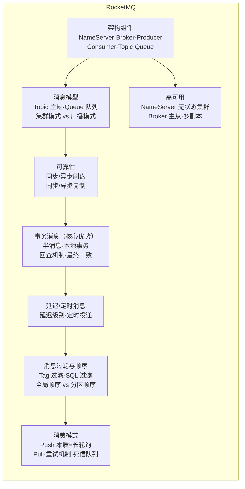

```mermaid
flowchart TB
    subgraph RocketMQ["RocketMQ"]
        direction TB
        R1["架构组件<br/>NameServer·Broker·Producer<br/>Consumer·Topic·Queue"] --> R2["消息模型<br/>Topic 主题·Queue 队列<br/>集群模式 vs 广播模式"]
        R2 --> R3["可靠性<br/>同步/异步刷盘<br/>同步/异步复制"]
        R3 --> R4["事务消息（核心优势）<br/>半消息·本地事务<br/>回查机制·最终一致"]
        R4 --> R5["延迟/定时消息<br/>延迟级别·定时投递"]
        R5 --> R6["消息过滤与顺序<br/>Tag 过滤·SQL 过滤<br/>全局顺序 vs 分区顺序"]
        R1 --> R7["高可用<br/>NameServer 无状态集群<br/>Broker 主从·多副本"]
        R6 --> R8["消费模式<br/>Push 本质=长轮询<br/>Pull·重试机制·死信队列"]
    end
```
