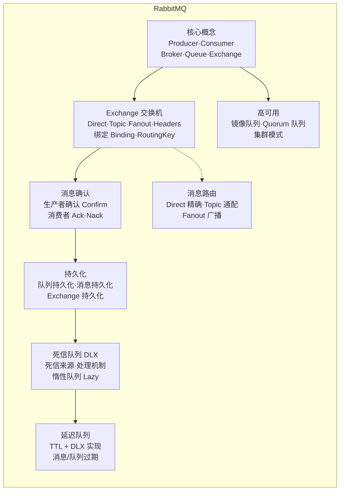

```mermaid
flowchart TB
    subgraph RabbitMQ["RabbitMQ"]
        direction TB
        Q1["核心概念<br/>Producer·Consumer<br/>Broker·Queue·Exchange"] --> Q2["Exchange 交换机<br/>Direct·Topic·Fanout·Headers<br/>绑定 Binding·RoutingKey"]
        Q2 --> Q3["消息确认<br/>生产者确认 Confirm<br/>消费者 Ack·Nack"]
        Q3 --> Q4["持久化<br/>队列持久化·消息持久化<br/>Exchange 持久化"]
        Q4 --> Q5["死信队列 DLX<br/>死信来源·处理机制<br/>惰性队列 Lazy"]
        Q5 --> Q6["延迟队列<br/>TTL + DLX 实现<br/>消息/队列过期"]
        Q1 --> Q7["高可用<br/>镜像队列·Quorum 队列<br/>集群模式"]
        Q2 -.-> Q8["消息路由<br/>Direct 精确·Topic 通配<br/>Fanout 广播"]
    end
```
