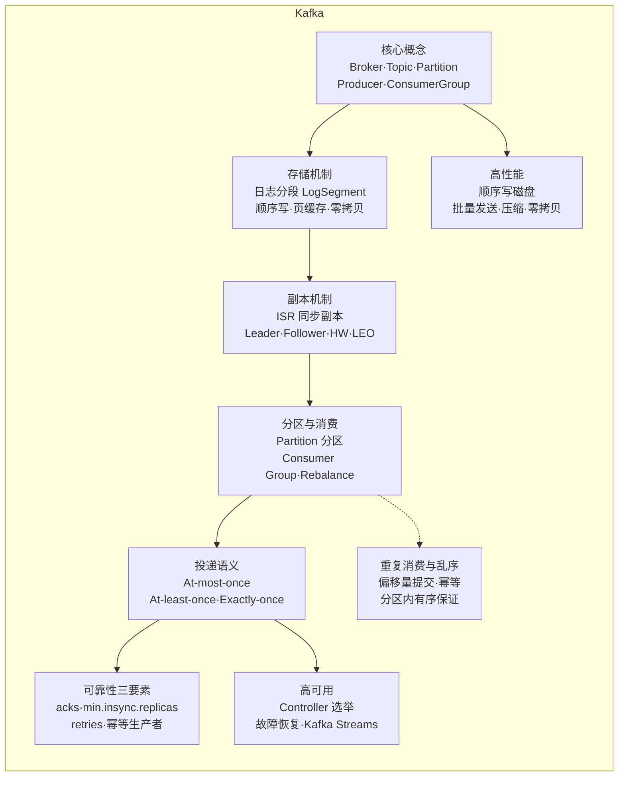

```mermaid
flowchart TB
    subgraph Kafka["Kafka"]
        direction TB
        K1["核心概念<br/>Broker·Topic·Partition<br/>Producer·ConsumerGroup"] --> K2["存储机制<br/>日志分段 LogSegment<br/>顺序写·页缓存·零拷贝"]
        K2 --> K3["副本机制<br/>ISR 同步副本<br/>Leader·Follower·HW·LEO"]
        K3 --> K4["分区与消费<br/>Partition 分区<br/>Consumer Group·Rebalance"]
        K4 --> K5["投递语义<br/>At-most-once<br/>At-least-once·Exactly-once"]
        K5 --> K6["可靠性三要素<br/>acks·min.insync.replicas<br/>retries·幂等生产者"]
        K1 --> K7["高性能<br/>顺序写磁盘<br/>批量发送·压缩·零拷贝"]
        K5 --> K8["高可用<br/>Controller 选举<br/>故障恢复·Kafka Streams"]
        K4 -.-> K9["重复消费与乱序<br/>偏移量提交·幂等<br/>分区内有序保证"]
    end
```
